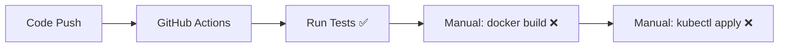
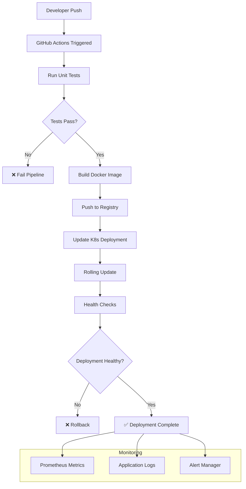

# Automated Container & Kubernetes Orchestration Guide

## Current State vs. Full Automation

### What You Have Now (Semi-Automated)


### Full CI/CD Automation Options

## Option 1: Docker Hub + External Kubernetes
```yaml
# .github/workflows/complete-cicd.yml
jobs:
  test: # Run tests
  build-and-deploy:
    steps:
    - Build Docker image
    - Push to Docker Hub
    - Deploy to Kubernetes cluster
```

**Automation Flow:**
1. Code push → GitHub Actions
2. Tests pass → Build container image
3. Push image → Docker Hub/Registry
4. Update Kubernetes deployment → Rolling update
5. Verify deployment → Health checks

## Option 2: GitHub Container Registry (Recommended)
```yaml
# Uses GitHub's built-in container registry
env:
  REGISTRY: ghcr.io
  IMAGE_NAME: ${{ github.repository }}

steps:
- name: Build and push Docker image
  uses: docker/build-push-action@v5
  with:
    push: true
    tags: ${{ steps.meta.outputs.tags }}
```

## Option 3: Cloud Provider Integration

### AWS EKS
```yaml
- name: Deploy to EKS
  uses: aws-actions/amazon-eks-deploy@v1
  with:
    cluster-name: my-cluster
    namespace: production
```

### Azure AKS
```yaml
- name: Deploy to AKS
  uses: Azure/k8s-deploy@v1
  with:
    namespace: production
    manifests: k8s/
```

### Google GKE
```yaml
- name: Deploy to GKE
  uses: google-github-actions/deploy-cloudrun@v1
```

## Deployment Strategies

### 1. Rolling Updates (Zero Downtime)
```yaml
# k8s/deployment.yaml
spec:
  strategy:
    type: RollingUpdate
    rollingUpdate:
      maxUnavailable: 1
      maxSurge: 1
```

### 2. Blue-Green Deployment
```yaml
# Two identical environments
# Switch traffic between them
- name: Deploy to Blue Environment
- name: Run Smoke Tests  
- name: Switch Traffic to Blue
- name: Decommission Green
```

### 3. Canary Deployment
```yaml
# Gradual rollout
# 10% → 50% → 100% traffic
spec:
  replicas: 10  # 1 new, 9 old initially
```

## Required Secrets & Configuration

### For Docker Hub
```bash
# GitHub Repository Secrets
DOCKER_USERNAME=your-dockerhub-username
DOCKER_PASSWORD=your-dockerhub-token
```

### For Kubernetes
```bash
# Base64 encoded kubeconfig
KUBE_CONFIG=base64-encoded-kubeconfig-file
```

### For Cloud Providers
```bash
# AWS
AWS_ACCESS_KEY_ID=xxx
AWS_SECRET_ACCESS_KEY=xxx

# Azure  
AZURE_CLIENT_ID=xxx
AZURE_CLIENT_SECRET=xxx

# Google Cloud
GCP_SA_KEY=base64-service-account-json
```

## Complete Automation Flow



## Environment-Based Deployment

### Development
- Deploy on every push to `develop` branch
- Use latest images
- Minimal resources

### Staging  
- Deploy on merge to `main`
- Run integration tests
- Production-like environment

### Production
- Manual approval required
- Tagged releases only
- Full monitoring & rollback capability

## GitOps Approach (Advanced)

```yaml
# Instead of kubectl in GitHub Actions
# Use ArgoCD/Flux for deployment

- name: Update Helm Chart
  run: |
    yq eval '.image.tag = "${{ github.sha }}"' -i helm/values.yaml
    git commit -am "Update image tag"
    git push
```

## Key Benefits of Full Automation

1. **Consistency** - Same process every time
2. **Speed** - Deploy in minutes, not hours  
3. **Reliability** - Automated testing prevents bad deployments
4. **Rollback** - Easy to revert to previous version
5. **Audit Trail** - Every deployment is tracked
6. **Scalability** - Handle multiple deployments per day

Choose the approach that matches your infrastructure and requirements!