# GitHub Container Registry (GHCR) Setup Guide

## ✅ Complete Automation with GHCR

This guide shows how to set up fully automated CI/CD using GitHub Container Registry.

## How It Works

```mermaid
graph LR
    A[Push to GitHub] --> B[GitHub Actions]
    B --> C[Run Tests]
    C --> D[Build Docker Image]
    D --> E[Push to GHCR]
    E --> F[Deploy to K8s]
    F --> G[✅ Live App]
```



## Setup Steps

### 1. Enable GitHub Container Registry

**It's already enabled!** GHCR is built into GitHub and uses your existing permissions.

### 2. Workflow Triggers

```yaml
on:
  push:
    branches: [ main, test ]  # Deploys on push to these branches
  pull_request:
    branches: [ main ]        # Tests on PRs
```

### 3. Container Registry Integration

```yaml
env:
  REGISTRY: ghcr.io
  IMAGE_NAME: ${{ github.repository }}  # nituka/githubactions

steps:
- name: Log in to Container Registry
  uses: docker/login-action@v3
  with:
    registry: ghcr.io
    username: ${{ github.actor }}      # Your GitHub username
    password: ${{ secrets.GITHUB_TOKEN }} # Automatic token
```

### 4. Image Tagging Strategy

Your images will be tagged as:
- `ghcr.io/nituka/githubactions:latest` (main branch)
- `ghcr.io/nituka/githubactions:test` (test branch)
- `ghcr.io/nituka/githubactions:main-abc1234` (commit SHA)

## Testing the Workflow

### Option A: Push to Test Branch (Staging)
```bash
git checkout test
git push origin test
```
**Result**: 
- ✅ Runs tests
- ✅ Builds & pushes image to GHCR
- ✅ Shows staging deployment commands

### Option B: Push to Main Branch (Production)
```bash
git checkout main
git push origin main
```
**Result**:
- ✅ Runs tests
- ✅ Builds & pushes image to GHCR  
- ✅ Shows production deployment commands
- ⚠️ Requires manual approval (production environment)

## Local Kubernetes Integration

### Pull and Use GHCR Image Locally
```bash
# After workflow runs, pull the image
docker pull ghcr.io/nituka/githubactions:latest

# Tag for local use
docker tag ghcr.io/nituka/githubactions:latest python-k8s-app:latest

# Deploy to local Kubernetes
kubectl apply -f k8s/deployment.yaml
kubectl apply -f k8s/service.yaml
```

### Or Update Deployment Directly
```bash
# Set image from GHCR
kubectl set image deployment/python-calculator \
  python-calculator=ghcr.io/nituka/githubactions:latest

# Check rollout status
kubectl rollout status deployment/python-calculator
```

## Viewing Your Images

1. Go to your GitHub repository
2. Click **"Packages"** tab (next to Code, Issues, etc.)
3. See all your container images with tags and details

## Environment Protection

### Staging Environment (test branch)
- ✅ Automatic deployment
- ✅ No approval required
- ✅ Safe for testing

### Production Environment (main branch)  
- ⚠️ Manual approval required
- ✅ Protected from accidental deployments
- ✅ Audit trail

## Advanced Features

### Automatic Vulnerability Scanning
GitHub automatically scans your images for security vulnerabilities.

### Package Permissions
- **Public repos**: Images are public by default
- **Private repos**: Images inherit repo permissions
- **Fine-grained**: Control access per package

### Multi-Architecture Support
```yaml
- name: Set up Docker Buildx
  uses: docker/setup-buildx-action@v3

- name: Build multi-arch image
  uses: docker/build-push-action@v5
  with:
    platforms: linux/amd64,linux/arm64
```

## Cost & Limits

✅ **Free for public repositories**
✅ **500MB storage included**  
✅ **Unlimited bandwidth for public images**
✅ **1GB storage for GitHub Pro**

## Troubleshooting

### Image Pull Errors
```bash
# Login to GHCR locally
echo $GITHUB_TOKEN | docker login ghcr.io -u USERNAME --password-stdin

# Pull image manually
docker pull ghcr.io/nituka/githubactions:latest
```

### Permission Issues
Ensure your workflow has:
```yaml
permissions:
  contents: read
  packages: write  # Required for GHCR
```

## Next Steps

1. **Push to test branch** to see automation in action
2. **Check Packages tab** to see your container image
3. **Deploy locally** using the GHCR image
4. **Set up production K8s cluster** for real deployments

Your CI/CD pipeline is now fully automated with GitHub Container Registry! 🚀